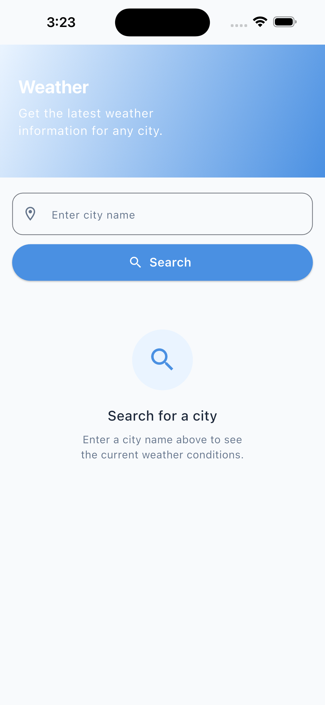
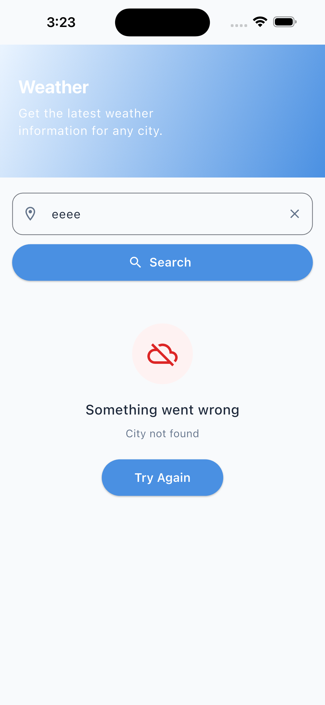

# 🌤️ Weather App

A Flutter weather application that allows users to search for a city and view its current weather conditions.

The app is built with a clean, scalable architecture and focuses on responsive UI, separation of concerns, error handling, and offline support.

---

## ✨ Features

- 🔍 Search for weather by city name
- 🌡️ Display current temperature
- ☁️ Display current weather condition and icon
- 📍 Display searched city name
- ⏳ Loading state while fetching weather data
- ❌ Error state with retry functionality
- 💾 Cache the last successfully fetched weather data
- 📱 Display cached weather data when the device is offline
- 📐 Responsive UI for different screen sizes
- 🧹 Clean and maintainable code structure

---

## 🏗️ Architecture

The project follows a **Feature-based Clean Architecture** approach.

```text
lib/
├── core/
│   ├── error/
│   ├── extensions/
│   ├── helper/
│   ├── shared_preferences/
│   └── themes/
│
└── features/
    └── weather/
        ├── data/
        │   ├── datasources/
        │   ├── models/
        │   └── repositories/
        │
        ├── domain/
        │   ├── entities/
        │   └── repositories/
        │
        └── presentation/
            ├── cubit/
            ├── screens/
            └── widgets/

## 📸 Screenshots

<p align="center">
  
  
  
</p>
